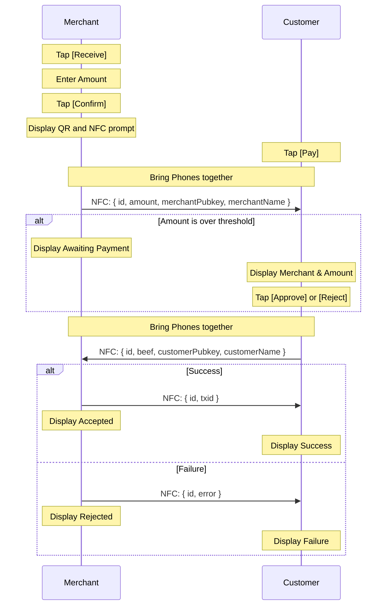

# NFC In Person Pull Payment

```mermaid
sequenceDiagram
    participant Merchant
    participant Customer

    note over Merchant: Tap [Receive]
    note over Merchant: Enter Amount
    note over Merchant: Tap [Confirm]
    note over Merchant: Display QR and NFC prompt
    note over Customer: Tap [Pay]
    note over Customer,Merchant: Bring Phones together
    Merchant->>Customer: NFC: { id, amount, merchantPubkey, merchantName }
    alt Amount is over threshold
        note over Merchant: Display Awaiting Payment
        note over Customer: Display Merchant & Amount
        note over Customer: Tap [Approve] or [Reject]
    end
    note over Customer,Merchant: Bring Phones together
    Customer->>Merchant: NFC: { id, beef, customerPubkey, customerName }
    alt Success
        Merchant->>Customer: NFC: { id, txid }
        note over Merchant: Display Accepted
        note over Customer: Display Success
    else Failure
        Merchant->>Customer: NFC: { id, error }
        note over Merchant: Display Rejected
        note over Customer: Display Failure
    end
```
