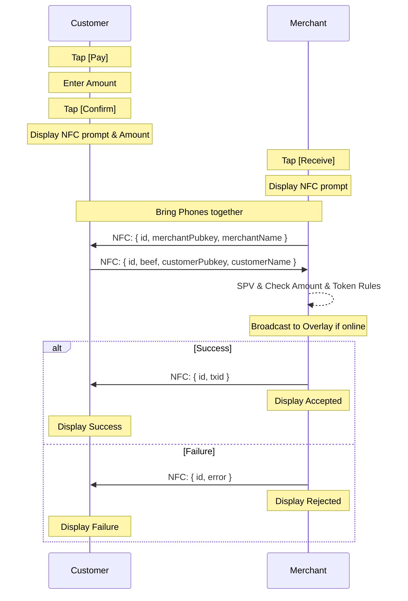

# NFC Push

```mermaid
sequenceDiagram
    participant Customer
    participant Merchant

    note over Customer: Tap [Pay]
    note over Customer: Enter Amount
    note over Customer: Tap [Confirm]
    note over Customer: Display NFC prompt & Amount
    note over Merchant: Tap [Receive]
    note over Merchant: Display NFC prompt
    note over Customer,Merchant: Bring Phones together
    Merchant->>Customer: NFC: { id, merchantPubkey, merchantName }
    Customer->>Merchant: NFC: { id, beef, customerPubkey, customerName }
    Merchant-->>Merchant: SPV & Check Amount & Token Rules
    note over Merchant: Broadcast to Overlay if online
    alt Success
        Merchant->>Customer: NFC: { id, txid }
        note over Merchant: Display Accepted
        note over Customer: Display Success
    else Failure
        Merchant->>Customer: NFC: { id, error }
        note over Merchant: Display Rejected
        note over Customer: Display Failure
    end
```
