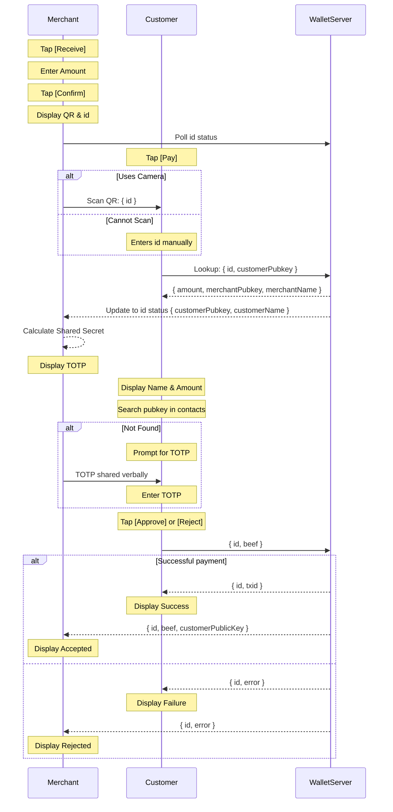

# Online Pull Payment

```mermaid
sequenceDiagram
    participant Merchant
    participant Customer
    participant WalletServer

    note over Merchant: Tap [Receive]
    note over Merchant: Enter Amount
    note over Merchant: Tap [Confirm]
    note over Merchant: Display QR & id
    Merchant->>WalletServer: Poll id status
    note over Customer: Tap [Pay]
    alt Uses Camera
        Merchant->>Customer: Scan QR: { id }
    else Cannot Scan
        note over Customer: Enters id manually
    end
    Customer->>WalletServer: Lookup: { id, customerPubkey }
    WalletServer-->>Customer: { amount, merchantPubkey, merchantName }
    WalletServer-->>Merchant: Update to id status { customerPubkey, customerName }
    Merchant-->>Merchant: Calculate Shared Secret
    note over Merchant: Display TOTP
    note over Customer: Display Name & Amount 
    note over Customer: Search pubkey in contacts
    alt Not Found
        note over Customer: Prompt for TOTP
        Merchant->>Customer: TOTP shared verbally
        note over Customer: Enter TOTP
    end
    note over Customer: Tap [Approve] or [Reject]
    Customer->>WalletServer: { id, beef }
    alt Successful payment
        WalletServer-->>Customer: { id, txid }
        note over Customer: Display Success
        WalletServer-->>Merchant: { id, beef, customerPublicKey }
        note over Merchant: Display Accepted
    else
        WalletServer-->>Customer: { id, error }
        note over Customer: Display Failure
        WalletServer-->>Merchant: { id, error }
        note over Merchant: Display Rejected 
    end
```
