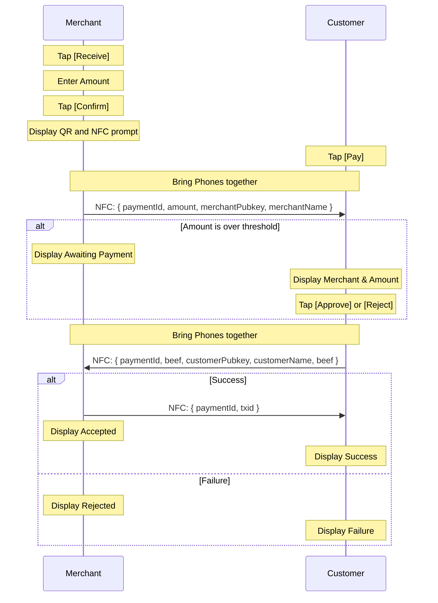
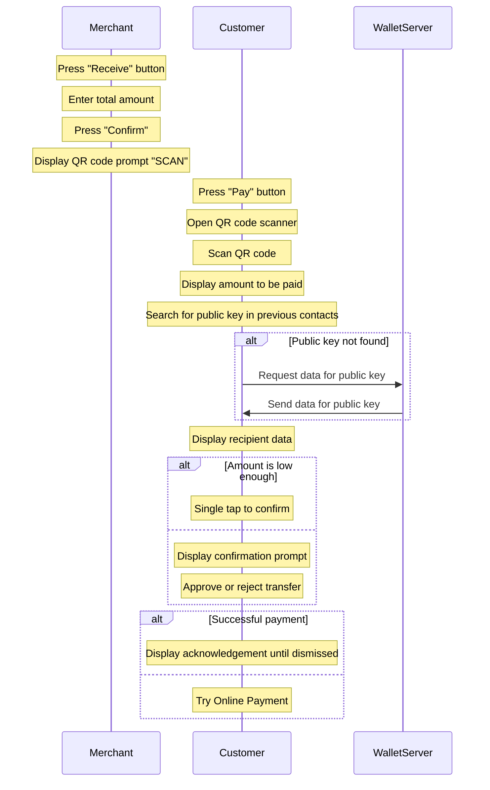
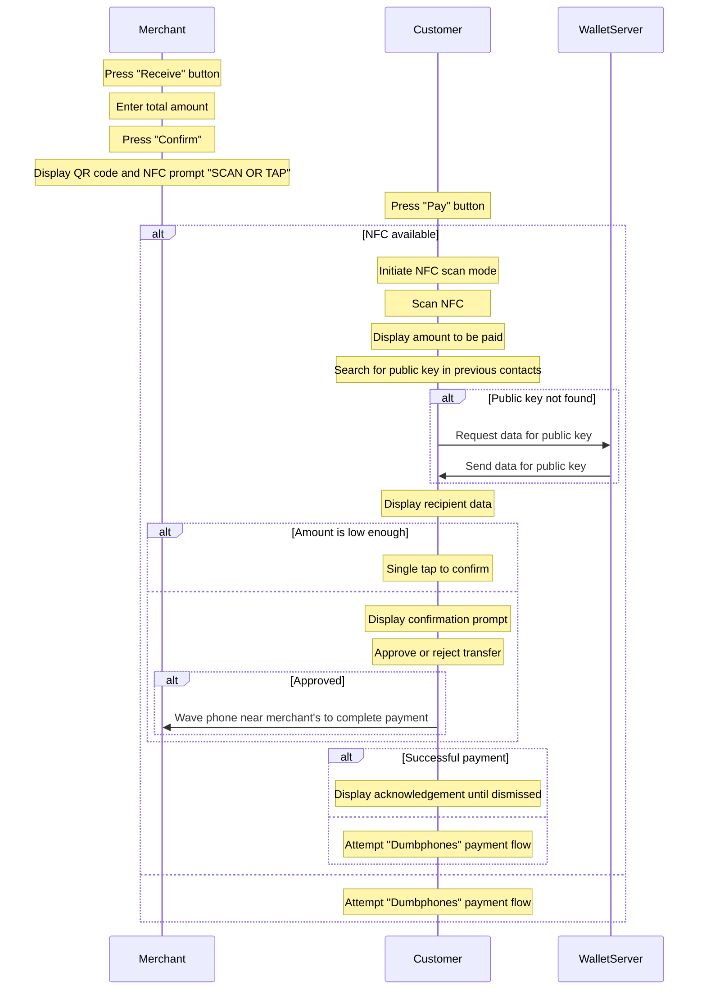

# Merchant UX

## Smartphones

### Scenario 1: Both merchant and customer have NFC phones

<!-- 
### Scenario 2: Neither have NFC

### Scenario 3: Customer doesn't have a camera on their phone

1. The merchant presses the "Receive" button, and is prompted to enter a total amount.
2. They press confirm whereby a QR code is displayed encoding their public key, a payment id, and an amount, and this information is also available through NFC, with an on screen prompt to allow a customer to bring their paying phone close. "SCAN OR TAP".
3. The customer hits a "pay" button which initiates NFC scan mode if available if not then opens QR code scanner.
4. Either scan mode populates their screen with information about the amount they owe. Their wallet searches their previous contacts for the public key, if not found a request is made to the wallet server to retrieve the data associated with the public key. That data is then displayed on screen indicating the repient of the funds.
5. If the amount to transfer is low enough, a single tap is all that is required. If the amount is over that threshold then a confirmation is displayed.
6. `OPTIONAL` The customer either rejects or approves the transfer, having checked the amount on screen. If approved is instructed to wave their phone near the merchant's a second time to complete the payment.
7. If successful an acknowledgement is displayed until dismissed.
8. If it fails they should attempt to use the "Dumbphones" payment flow instead.

## Dumbphones

1. We need service discovery, so merchant should give them a merchant id which is equivalent to a paymail.
2. Customer types that in, and sets the amount to whatever the merchant is expecting then merchant will see payment arrive in their phone assuming they're connected to the internet. -->
